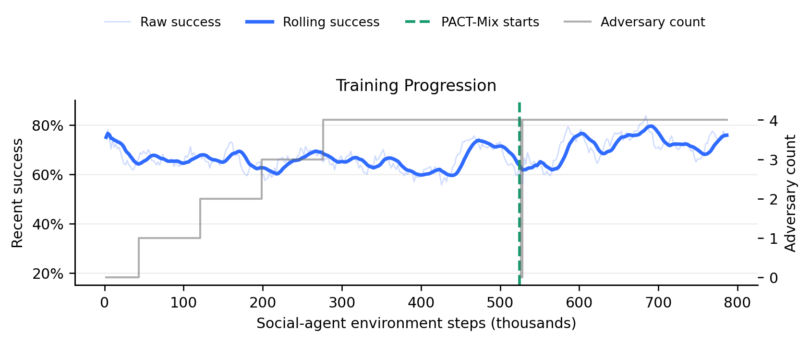
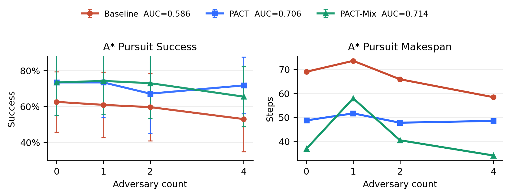
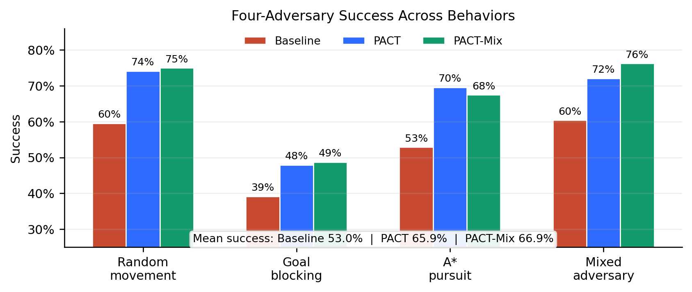
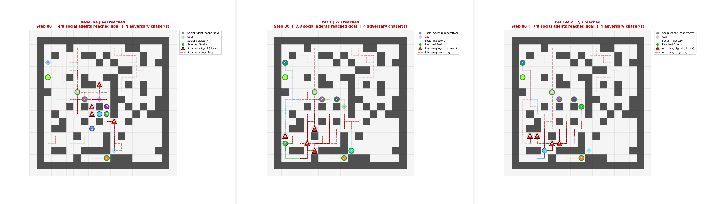
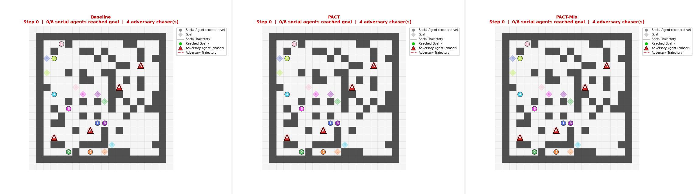

# PACT: Physical-Adversary Curriculum Training for Robust Multi-Agent Pathfinding

This repository contains Moniruzzaman Akash's CS 830 project on making multi-agent pathfinding policies more robust to physical, non-cooperative agents. The project builds on a shared POGEMA/PPO baseline and adds PACT, a curriculum-training approach where social agents learn while adversaries occupy the same grid, chase agents, block goals, and create congestion.

The main idea is simple: a MAPF policy should not only work in clean cooperative worlds. It should keep moving agents to their goals when other agents physically interfere with the plan.

## Highlights

- Implements physical adversary agents for POGEMA MAPF environments.
- Trains PACT from the shared PPO baseline using adversarial curriculum learning.
- Evaluates PACT and PACT-Mix against A* pursuit, random walk, goal blocking, and mixed adversaries.
- Keeps Akash-specific code, models, results, plots, and GIFs under `pact/`.
- Preserves the shared baseline as a reusable dependency under `cs830_shared_baseline/`.

## Project Structure

```text
.
+-- README.md                         # Project-facing README
+-- pact/                             # Akash's PACT implementation and artifacts
|   +-- curriculum_train.py           # Train/evaluate PACT and PACT-Mix style curricula
|   +-- adversary.py                  # A*, random walk, goal blocking, mixed adversaries
|   +-- ppo_mapf.py                   # PACT-local PPO trainer/evaluator
|   +-- evaluate_fragility.py         # PACT-local robustness sweeps
|   +-- visualize.py                  # Rollout GIF generation
|   +-- models/                       # PACT checkpoints
|   +-- results/                      # PACT plots, JSON summaries, GIFs, CSVs
+-- cs830_shared_baseline/            # Shared baseline package and original handoff README
|   +-- README.md
|   +-- requirements.txt
|   +-- src/
|   +-- models/phase2_smoke_baseline/
|   +-- results/
+-- final_paper/                      # Paper materials
+-- poster/                           # Poster materials
```

## Method at a Glance

PACT starts from the shared PPO baseline checkpoint and continues training under physical adversary pressure. The social agents still use one shared PPO policy, but extra adversary agents are inserted into the grid and controlled by handcrafted physical behaviors.

| Component | Role |
| --- | --- |
| Baseline PPO | Shared clean MAPF policy used as the starting point |
| PACT | Curriculum training with increasing A* pursuit adversaries |
| PACT-Mix | Continued training from PACT with mixed adversary behavior |
| Physical adversaries | Grid agents that chase, wander, block goals, or mix strategies |
| Evaluation | Sweeps over adversary count, adversary type, and observation noise |

## Headline Results

The table below reports success rate with four physical adversaries. Higher is better.

| Physical adversary type | Baseline | PACT | PACT-Mix |
| --- | ---: | ---: | ---: |
| Random movement | 59.6% | 74.2% | 75.0% |
| Goal blocking | 39.2% | 47.9% | 48.8% |
| A* pursuit | 52.9% | 69.6% | 67.5% |
| Mixed adversary | 60.4% | 72.1% | 76.2% |
| Mean across types | 53.0% | 65.9% | 66.9% |

Key takeaway: PACT improves directed A* pursuit robustness, while PACT-Mix gives the best broad average across adversary types.

## Visual Results

### Training Dynamics

PACT first adapts under an A* pursuit curriculum, then the mixed variant continues with broader physical pressure.



### Physical Robustness Sweep

Success rate is measured as the number of physical adversaries increases.



### Cross-Adversary Generalization

PACT-Mix is designed to generalize beyond a single adversary behavior.



### Representative Rollout

A matched mixed-adversary rollout shows how the robust policies keep more agents moving toward goals under congestion.



### Animation

The GIF below compares policies in the same mixed physical-adversary setting.



## Installation

Run these commands from the repository root.

```bash
cd path/to/cs830_final_project
python -m venv .venv
source .venv/bin/activate
pip install -r cs830_shared_baseline/requirements.txt
```

The project was developed with Python 3.12 and uses:

- numpy
- torch
- pogema
- gymnasium
- matplotlib
- imageio
- tqdm

If PyTorch installation needs a CUDA-specific wheel on your machine, install the matching PyTorch build first, then install the remaining requirements.

## Quick Start

### 1. Evaluate an Existing PACT Checkpoint

```bash
python pact/curriculum_train.py \
  --mode evaluate \
  --config quick \
  --akash-checkpoint pact/models/quick_akash_curriculum/best_policy.pt \
  --results-dir /tmp/pact_eval \
  --eval-episodes 10 \
  --device cpu
```

### 2. Evaluate PACT-Mix Under Mixed Adversaries

```bash
python pact/curriculum_train.py \
  --mode evaluate \
  --config quick \
  --akash-checkpoint pact/models/quick_pact_mix_from_pact/best_policy.pt \
  --adversary-strategy mixed \
  --results-dir /tmp/pact_mix_eval \
  --eval-episodes 10 \
  --device cpu
```

### 3. Run a Small Smoke Training Job

This is useful for checking that the environment, baseline checkpoint, and PACT code are wired correctly.

```bash
python pact/curriculum_train.py \
  --mode full \
  --config smoke \
  --total-timesteps 4096 \
  --n-steps 128 \
  --batch-size 128 \
  --save-dir /tmp/pact_smoke_models \
  --results-dir /tmp/pact_smoke_results \
  --device cpu
```

### 4. Generate a Rollout GIF

```bash
python pact/visualize.py \
  --robust-model pact/models/quick_akash_curriculum/final_policy.pt \
  --output-dir pact/results/animations \
  --adversary-strategy astar_pursuit \
  --physical-only \
  --device cpu
```

## Important Artifacts

| Artifact | Path |
| --- | --- |
| Shared baseline checkpoint | `cs830_shared_baseline/models/phase2_smoke_baseline/best_policy.pt` |
| PACT checkpoint | `pact/models/quick_akash_curriculum/best_policy.pt` |
| PACT-Mix checkpoint | `pact/models/quick_pact_mix_from_pact/best_policy.pt` |
| Main three-policy summary | `pact/results/main/akash_pact_vs_mix_clean/pact_vs_mix_summary.json` |
| Physical robustness plot | `pact/results/main/akash_pact_vs_mix_clean/physical_robustness_three_policy.png` |
| Cross-adversary plot | `pact/results/main/akash_pact_vs_mix_clean/mixed_adversary_type_comparison_three_policy.png` |
| Mixed rollout GIF | `pact/results/main/akash_pact_vs_mix_clean/animations_mixed_direct/comparison_mixed_threeway_direct.gif` |
| Paper bundle CSVs | `pact/results/main/akash_paper_bundle/` |

## Reproducibility Notes

- PACT-owned code and generated artifacts live under `pact/`.
- The shared baseline remains under `cs830_shared_baseline/` and is used as a dependency and reference checkpoint source.
- The baseline checkpoint is intentionally not overwritten by PACT training.
- New training/evaluation outputs should be written to `pact/models/`, `pact/results/`, or a temporary path such as `/tmp/...` for quick checks.

## Scope and Limitations

This project focuses on physical adversary robustness: adversaries change the grid by occupying cells, chasing agents, blocking goals, and creating congestion. FGSM observation-noise sweeps are included as a cross-robustness check, but digital observation robustness is not the main claim.

The strongest conclusion is that physical curriculum training improves robustness to physical MAPF interference, especially when the adversary distribution at evaluation resembles the physical pressures seen during training.

## Author

Moniruzzaman Akash  
CS 830: Artificial Intelligence  
University of New Hampshire
