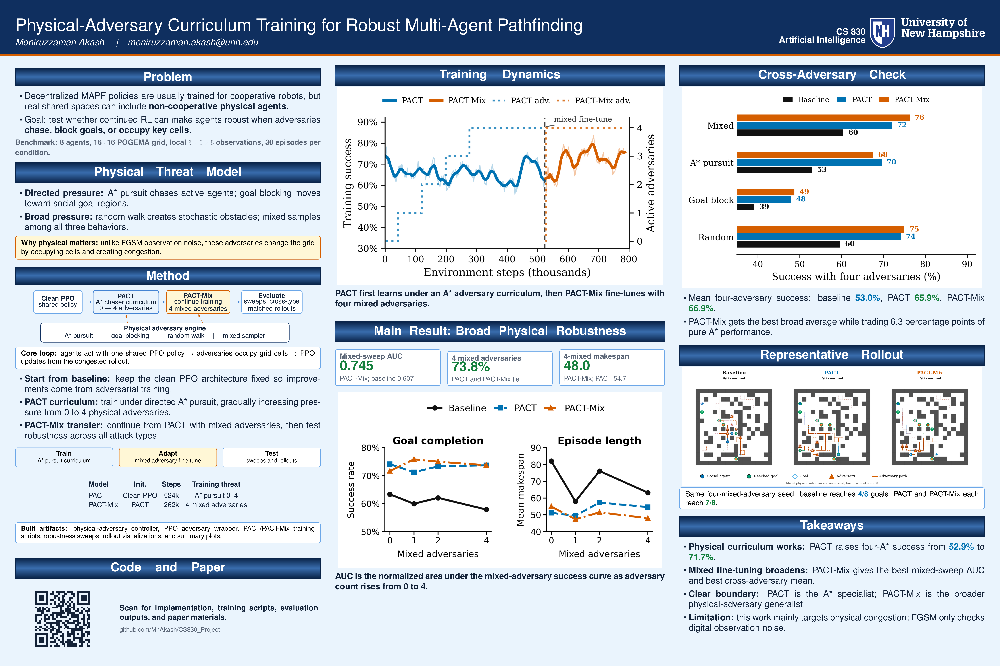
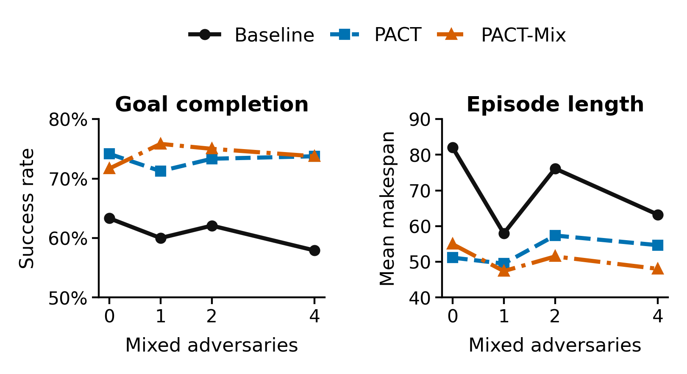
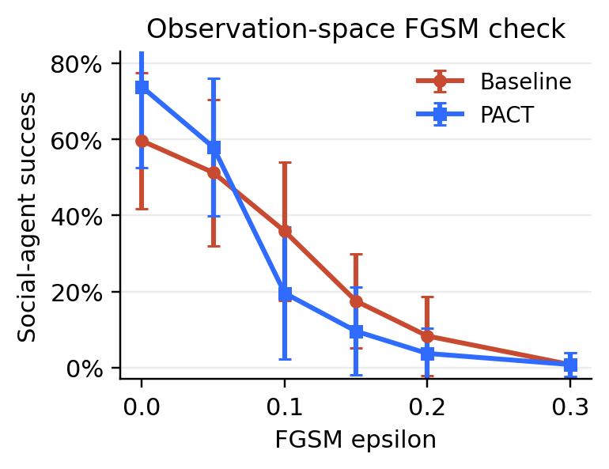

# PACT: Physical-Adversary Curriculum Training for Robust Multi-Agent Pathfinding

This repository contains Moniruzzaman Akash's CS 830 project on making multi-agent pathfinding policies more robust to physical, non-cooperative agents. The project builds on a shared POGEMA/PPO baseline and adds PACT, a curriculum-training approach where social agents learn while adversaries occupy the same grid, chase agents, block goals, and create congestion.

The main idea is simple: a MAPF policy should not only work in clean cooperative worlds. It should keep moving agents to their goals when other agents physically interfere with the plan.

## Highlights

- Implements physical adversary agents for POGEMA MAPF environments.
- Trains PACT from the shared PPO baseline using adversarial curriculum learning.
- Evaluates PACT and PACT-Mix against A* pursuit, random walk, goal blocking, and mixed adversaries.
- Keeps Akash-specific code, models, results, plots, and GIFs under `pact/`.
- Preserves the shared baseline as a reusable dependency under `cs830_shared_baseline/`.

## Project Structure

```text
.
+-- README.md                         # Project-facing README
+-- pact/                             # Akash's PACT implementation and artifacts
|   +-- curriculum_train.py           # Train/evaluate PACT and PACT-Mix style curricula
|   +-- adversary.py                  # A*, random walk, goal blocking, mixed adversaries
|   +-- ppo_mapf.py                   # PACT-local PPO trainer/evaluator
|   +-- evaluate_fragility.py         # PACT-local robustness sweeps
|   +-- visualize.py                  # Rollout GIF generation
|   +-- models/                       # PACT checkpoints
|   +-- results/                      # PACT plots, JSON summaries, GIFs, CSVs
+-- cs830_shared_baseline/            # Shared baseline package and original handoff README
|   +-- README.md
|   +-- requirements.txt
|   +-- src/
|   +-- models/phase2_smoke_baseline/
|   +-- results/
+-- doc/                             # Overview image for README
```

## Overview

The project overview image is shown below:



If you want the shortest visual summary of the project, start with the image above and then use the figures below for the full result breakdown.

## Method at a Glance

PACT starts from the shared PPO baseline checkpoint and continues training under physical adversary pressure. The social agents still use one shared PPO policy, but extra adversary agents are inserted into the grid and controlled by handcrafted physical behaviors.

| Component | Role |
| --- | --- |
| Baseline PPO | Shared clean MAPF policy used as the starting point |
| PACT | Curriculum training with increasing A* pursuit adversaries |
| PACT-Mix | Continued training from PACT with mixed adversary behavior |
| Physical adversaries | Grid agents that chase, wander, block goals, or mix strategies |
| Evaluation | Sweeps over adversary count, adversary type, and observation noise |

## Reported Benchmark

Unless otherwise noted, the results highlighted below use the reported 8-agent benchmark:

| Setting | Value |
| --- | --- |
| Social agents | 8 |
| Grid size | 16 x 16 |
| Obstacle density | 0.30 |
| Max episode steps | 128 |
| Evaluation episodes per point | 30 |
| Social policy | Shared PPO actor-critic |
| PACT curriculum | A* pursuit adversaries, 0 -> 4 |
| PACT-Mix fine-tuning | 4 mixed adversaries |

Success rate means the fraction of social agents that reach their goals. AUC means the normalized area under the success-rate curve as the number of adversaries increases.

## Results Overview

There are two distinct result stories in this repository:

1. **PACT as the specialist**
   - The main curriculum is designed around A* pursuit adversaries.
   - This is the strongest direct robustness claim in the project.

2. **PACT-Mix as the broader generalist**
   - PACT-Mix continues from the PACT checkpoint and broadens robustness across random movement, goal blocking, A* pursuit, and mixed adversaries.

### Main A* Pursuit Result

This is the cleanest single-number result for the curriculum idea:

| Metric | Baseline | PACT | Change |
| --- | ---: | ---: | ---: |
| Clean success | 62.5% | 73.3% | +10.8 pp |
| Success with 4 A* chasers | 52.9% | 71.7% | +18.8 pp |
| Drop from clean to 4 chasers | 9.6 pp | 1.6 pp | 8.0 pp smaller drop |
| A* physical robustness AUC | 0.586 | 0.706 | +0.120 |

Interpretation: PACT does not just improve the attacked case. It also makes the policy degrade much less sharply as the number of physical chasers increases.

### Broad Physical Robustness Result

The final three-policy comparison shows the expected tradeoff between specialization and generalization.

| Physical adversary type at 4 attackers | Baseline | PACT | PACT-Mix |
| --- | ---: | ---: | ---: |
| Random movement | 59.6% | 74.2% | 75.0% |
| Goal blocking | 39.2% | 47.9% | 48.8% |
| A* pursuit | 52.9% | 71.7% | 65.4% |
| Mixed adversary | 60.4% | 73.8% | 73.8% |
| Mean across types | 53.0% | 65.9% | 66.9% |

Interpretation:

- PACT is strongest on the exact A* pursuit threat it was trained against.
- PACT-Mix gives the best average across different physical adversary types.
- The broad-robustness summary is the mixed-adversary sweep AUC: baseline `0.607`, PACT `0.730`, PACT-Mix `0.745`.

### Claim Boundary

This project is about **physical adversary robustness**, not universal adversarial robustness.

- Under strong FGSM observation attacks, PACT does not outperform the baseline.
- The right claim is: curriculum exposure to embodied adversaries improves robustness to physical interference on the grid.

## Visual Results

The overview image above is the presentation-friendly summary. The figures below unpack the same story in more detail and separate the specialized A* result from the broader mixed-adversary result.

### Training Dynamics

PACT first learns under an A* pursuit curriculum, then PACT-Mix continues from that checkpoint with four mixed adversaries.


What to notice:

- The adversary count ramps up during PACT instead of jumping directly to the hardest setting.
- PACT-Mix begins only after the A* curriculum has already produced a robust checkpoint.
- The project uses continuation training rather than retraining a new policy from scratch.

### A* Pursuit Robustness Sweep

This figure is the direct specialization check for the main PACT curriculum.


What to notice:

- As the number of A* chasers increases, the baseline drops much faster than PACT.
- PACT improves the hardest four-chaser condition from `52.9%` to `71.7%`.
- PACT-Mix remains strong, but it is not the best pure A* policy because it trades some specialization for broader coverage.

### Broad Physical Robustness Sweep

This is the clearest summary of broad physical robustness under mixed attackers.



What to notice:

- At four mixed adversaries, the baseline falls to `57.9%`, while both PACT and PACT-Mix reach `73.8%`.
- PACT-Mix also shortens mean makespan from `54.7` to `48.0` relative to PACT at the same four-mixed setting.
- The mixed-sweep AUC improves from `0.607` to `0.730` to `0.745`, which is why PACT-Mix is the strongest broad-robustness model.

### Cross-Adversary Generalization

This figure compares the three policies at four attackers across four physical threat types.


What to notice:

- PACT improves over the baseline on all four threat types.
- PACT-Mix improves over PACT on random movement, goal blocking, and mixed adversaries.
- PACT remains stronger than PACT-Mix on pure A* pursuit, which matches the design of the training curriculum.

### Qualitative Rollout

The qualitative result matches the aggregate numbers: the robust policies keep more agents moving toward goals under the same mixed-adversary seed.


In the representative rollout shown above:

- Baseline reaches `4/8` goals
- PACT reaches `7/8`
- PACT-Mix reaches `7/8`

### Animation

The GIF below shows the same mixed physical-adversary setting as an animation rather than a final frame.


### FGSM Limitation

The method does not solve observation-space robustness, and the README makes that explicit because it is part of the final result story.



What to notice:

- Physical-adversary training helps against embodied agents on the grid.
- It does not automatically transfer to stronger FGSM sensor attacks.
- This keeps the main claim narrow and defensible.

## Installation

Run these commands from the repository root.

```bash
cd path/to/cs830_final_project
python -m venv .venv
source .venv/bin/activate
pip install -r cs830_shared_baseline/requirements.txt
```

The project was developed with Python 3.12 and uses:

- numpy
- torch
- pogema
- gymnasium
- matplotlib
- imageio
- tqdm

If PyTorch installation needs a CUDA-specific wheel on your machine, install the matching PyTorch build first, then install the remaining requirements.

## Quick Start

### 1. Evaluate an Existing PACT Checkpoint

```bash
python pact/curriculum_train.py \
  --mode evaluate \
  --config quick \
  --akash-checkpoint pact/models/quick_akash_curriculum/best_policy.pt \
  --results-dir /tmp/pact_eval \
  --eval-episodes 10 \
  --device cpu
```

### 2. Evaluate PACT-Mix Under Mixed Adversaries

```bash
python pact/curriculum_train.py \
  --mode evaluate \
  --config quick \
  --akash-checkpoint pact/models/quick_pact_mix_from_pact/best_policy.pt \
  --adversary-strategy mixed \
  --results-dir /tmp/pact_mix_eval \
  --eval-episodes 10 \
  --device cpu
```

### 3. Run a Small Smoke Training Job

This is useful for checking that the environment, baseline checkpoint, and PACT code are wired correctly.

```bash
python pact/curriculum_train.py \
  --mode full \
  --config smoke \
  --total-timesteps 4096 \
  --n-steps 128 \
  --batch-size 128 \
  --save-dir /tmp/pact_smoke_models \
  --results-dir /tmp/pact_smoke_results \
  --device cpu
```

### 4. Generate a Rollout GIF

```bash
python pact/visualize.py \
  --robust-model pact/models/quick_akash_curriculum/final_policy.pt \
  --output-dir pact/results/animations \
  --adversary-strategy astar_pursuit \
  --physical-only \
  --device cpu
```

## Reproducibility Notes

- PACT-owned code and generated artifacts live under `pact/`.
- The shared baseline remains under `cs830_shared_baseline/` and is used as a dependency and reference checkpoint source.
- The baseline checkpoint is intentionally not overwritten by PACT training.
- New training/evaluation outputs should be written to `pact/models/`, `pact/results/`, or a temporary path such as `/tmp/...` for quick checks.

## Scope and Limitations

This project focuses on physical adversary robustness: adversaries change the grid by occupying cells, chasing agents, blocking goals, and creating congestion. FGSM observation-noise sweeps are included as a cross-robustness check, but digital observation robustness is not the main claim.

The strongest conclusion is that physical curriculum training improves robustness to physical MAPF interference, especially when the adversary distribution at evaluation resembles the physical pressures seen during training.

## Author

Moniruzzaman Akash  
CS 830: Artificial Intelligence  
University of New Hampshire
